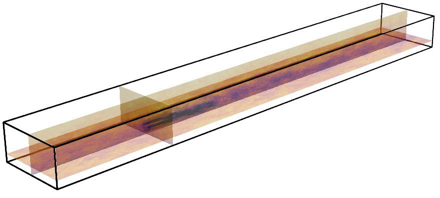
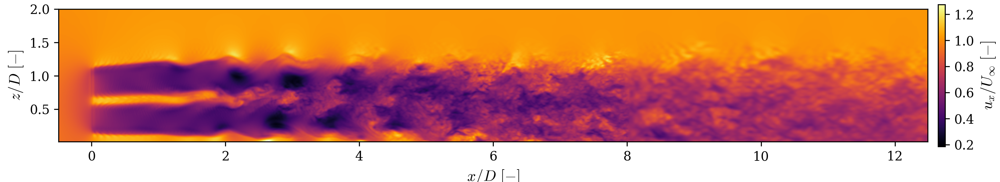
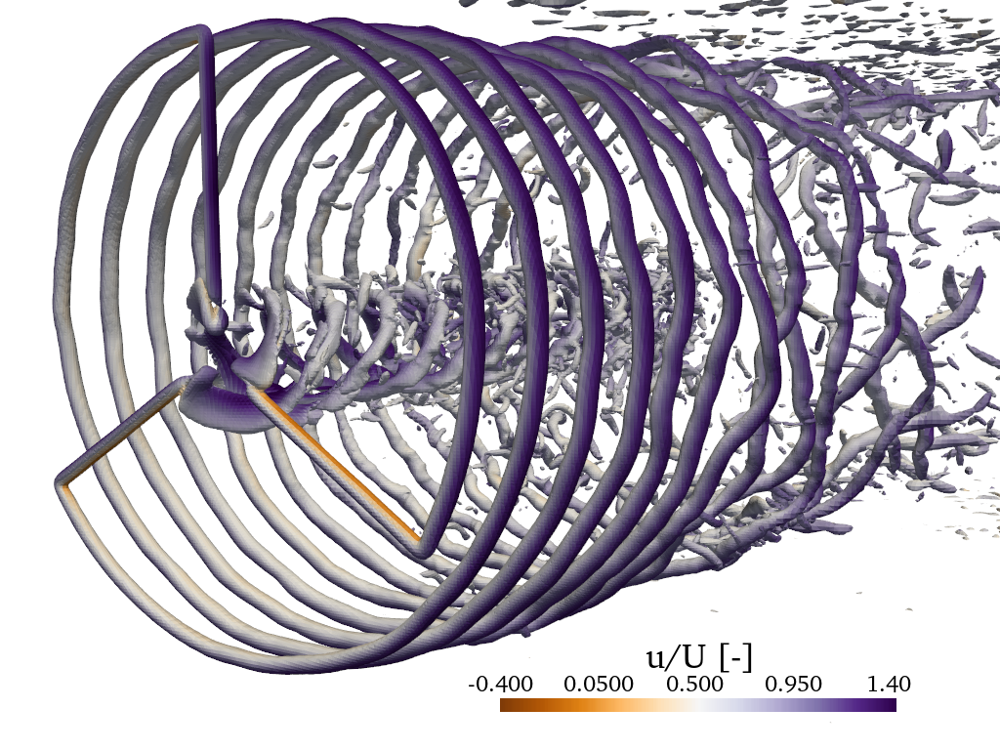
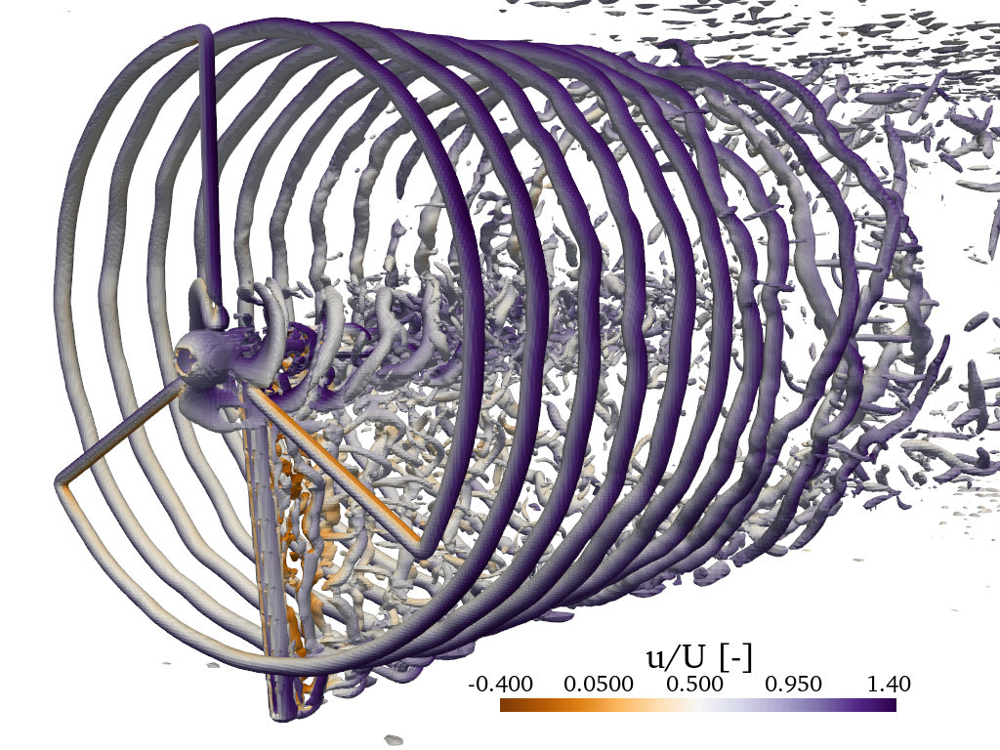
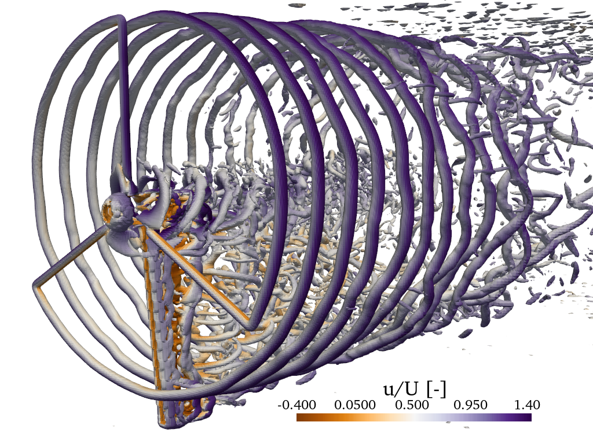

<h1>Hi, I'm Dylan.</h1>
I am a current DPhil student studying wind energy. My background is in maths and physics. I have an interest in numerical methods and its applications like CFD. <b>If you would like to get in touch you can find my contact information below</b>

     
  
  &nbsp;
  
  &nbsp;
  
  &nbsp;
  

<h2>My Interests</h2>

- Computational fluid dynamics
- High performance parallel code
- Wind energy (in particular floating wind turbine wakes)
- Scientific computing
- Computational physics

 
<h2> My Research </h2>
I work on computational fluid dynamics with appplications to wind energy. Here is a quick gallery of some of the work I do:

   
  <em>Velocity field of a wind turbine in a turbulent sheared inflow.</em>

 

   
  <em>Velocity field of a pitching turbine in uniform inflow.</em>

 

  
  
   
  <em>
    Q-criterion of a pitching turbine wake using different support structure models. 
    Left: no model · Middle: dynamically meshed support structure · Right: immersed boundary support structure.
  </em>

